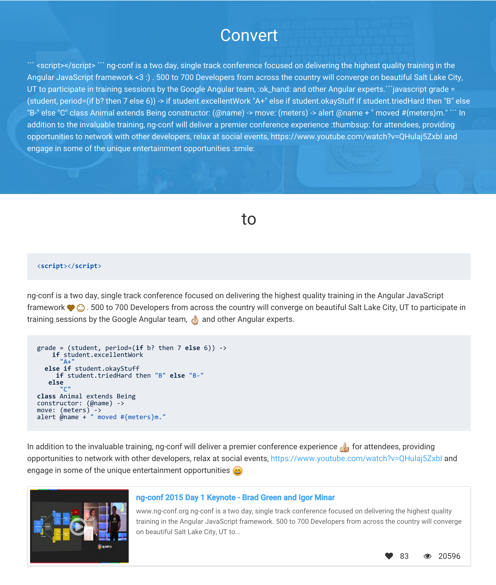

An AngularJS filter/directive for  converting text into emoticons, embedding videos (youtube/vimeo/mp4,ogg), audio, pdf, and highlighting code syntax in an ordinary text string. .

Documentation and examples
--------------------------

* [Full Documentation](http://ritz078.github.io/ngEmoticons/#/documentation)
* [Examples](http://ritz078.github.io/ngEmoticons/#/examples)

Features
--------

* Converts emoticon text codes into emoticons :smile: , :heart:
* Finds links in text input and turns them into html links.
* Youtube and Vimeo video embedding
* HTML5 player supported media embedding (mp3,mp4,ogg)
* PDF viewing with preview and then the actual pdf in a frame.
* Inline Code Syntax highlighting (uses highlight.js)



Dependencies
------------
+ AngularJs 1.2 or above
+ angular-sanitize 1.2 or above
+ [highlight.js](https://highlightjs.org/) (Optional if code highlighting required)


Getting Started
---------------

Install through bower
```html
bower install --save ng-emoticons
```
Install through npm
```html
npm install --save ng-emoticons
```

load css files
```html
 <link rel="stylesheet" href="path/to/ng-emoticons.min.css"/>
```

 Then load the following files
```html
<script src="bower_components/angular/angular.js"></script>
<script src="bower_components/angular-sanitize/angular-sanitize.js"></script>
<script src="path/to/ng-emoticons.js"></script>
```

Load 'Emoticons' as a dependency
```javascript
angular.module('yourAppname', ['ngEmoticons'])
```

Version 2.0.0
-------------

* Video embedding added
* code syntax highlighting added
* media embedding added
* pdf viewing added


Older releases are listed [here](RELEASES.md)

Contributing
------------

* If you are Interested in contributing to this project, you are most welcome.
* If it is a bug-fix/improvement, first report it at [issues](https://github.com/ritz078/ngEmoticons/issues)
* Discuss with us in detail about your issue/improvement
* Get the issue allotted.
* If you are contributing a bug-fix or a very minor addition, feel free to do a pull request on the master # branch.
* If you are unsure about the bug/improvement, create an issue to discuss.
* Report bugs @ [issues](https://github.com/ritz078/ngEmoticons/issues)


License
-------

The MIT License (MIT)

Copyright (c) 2014 Ritesh Kumar


